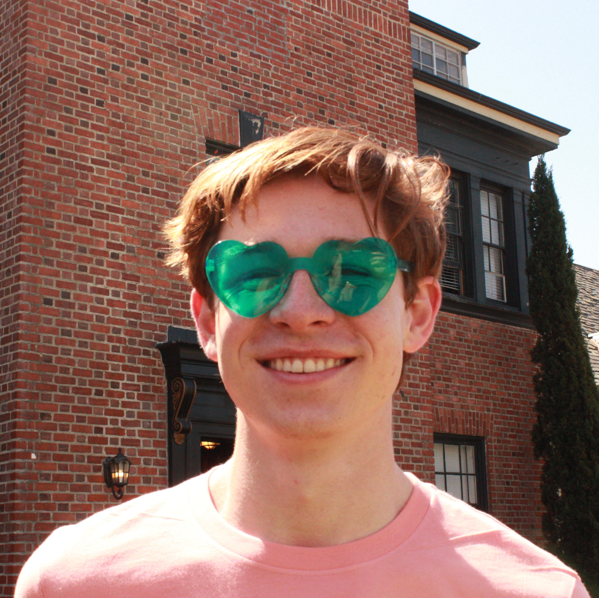

::: {.grid}

::: {.g-col-12 .g-col-md-3 .profile-sidebar}

{.rounded .img-fluid}

### Ethan Elasky

AI Researcher supported by Coefficient Giving

[ LinkedIn](https://www.linkedin.com/in/ethanelasky/){.sidebar-link}

[ Twitter](https://twitter.com/ethanelasky){.sidebar-link}

[ GitHub](https://github.com/ethanelasky){.sidebar-link}

[ Email](mailto:elasky2024@berkeley.edu){.sidebar-link}

:::

::: {.g-col-12 .g-col-md-9}

## About me

I am an AI researcher supported by Coefficient Giving, studying scalable oversight, AI debate, and control. I'm interested in faithful training processes, legible model reasoning, and extending advances in problem solving beyond verifiable domains.

Previously, I was a Research Assistant at [Academia Sinica](https://www.sinica.edu.tw/en/) and founding engineer at [Acaceta](https://acaceta.com). I studied data science, mathematics, and Chinese at UC Berkeley (magna cum laude, 3.98/4.00, Phi Beta Kappa).

I am a dual 🇺🇸 🇸🇰 citizen who speaks Mandarin fluently and Japanese at an intermediate level. In high school I was ranked top-50 worldwide in Lincoln-Douglas debate, and I authored [*Lincoln Douglas Debate from First Principles*](http://lddebatebook.com/).

Outside of research, I enjoy reading, road biking, surfing, and playing pickleball, tennis, and golf.

## Projects {#projects}

**AI Debate for Scalable Oversight** | 2025–present
: *Independent · Remote*
: Studying debate as a mechanism for AI control and scalable oversight, supported by Coefficient Giving (formerly Open Philanthropy). [Testing Generative Debate on Coding and Reasoning Tasks](https://www.lesswrong.com/posts/kQCLPighFvb4ChHtu/inference-time-generative-debates-on-coding-and-reasoning) (with Frank Nakasako).

**Reasoning Training & Evidence-Based QA** | 2024–2025
: *Advisor: Lun-Wei Ku · Academia Sinica, Taipei*
: Investigated how reasoning training impacts evidence-based question answering at Academia Sinica, in the NLP Lab of Professor Lun-Wei Ku. Role in Mandarin Chinese.

**Quantifying Bias in Taiwanese Media** | 2023–2024
: *Advisor: [Lucy Li](https://lucy3.github.io) · UC Berkeley*
: Honors thesis applying NLP techniques to measure bias in Taiwanese media coverage. Includes an [interactive topic model visualization](projects/tmc-interactives/tmc_10_topic_visualization_gensim.html).

**Lincoln Douglas Debate from First Principles** | 2022
: *Independent · Berkeley, CA*
: Authored a [textbook](http://lddebatebook.com/) on Lincoln-Douglas debate that has helped hundreds of students improve at the activity.

:::

:::
