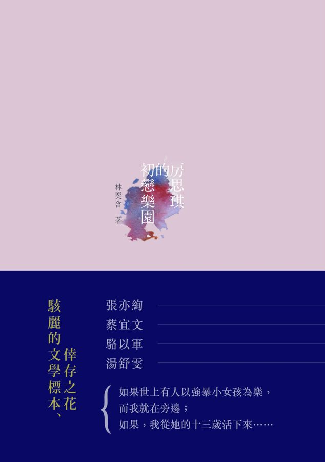

*Below is my translation of an interview with Lin Yi-Han discussing her novel Fang Si-Chi's First Love Paradise. The first draft of the translation was mine, with small edits on subsequent drafts from Claude Fable 5.1. I [read](https://www.goodreads.com/user/show/119697841) in the original Chinese. I progressed the first third of this book little by little in Fall 2025, and then the rest all at once during the summer of 2026. I haven't read the English translation by Jenna Tang, and all translations of the original text are my own, though I follow that translation's convention when translating names, with one exception: I write Yiwen for 伊紋, where Tang has “Iwen.” Note that this translation is cleaner, and thus hopefully more readable, than the original oral transcript.*

---

{width=45% fig-align="center"}

Many people after reading my book say “This is a story about girls getting seduced or raped.” Summing this book up in one sentence is improper, but if you forced me to change that sentence, I would say “this is a story about a girl growing to love her rapist.” That sentence contains the word “love,” and Si-Chi[^names] is fated to walk towards ruin without turning back precisely because she has tenderness, desires, love, and even sex in her heart. This is not an angry book, nor is it meant as an indictment. I'm going to avoid talking about “seduction” and “rape,” because anyone who reads this book and doesn't see those things is playing deaf and dumb. Instead, I came to talk about a larger topic. 

When you’re watching the news, when you see “victims” and “perpetrators” and detailed dialogues, when you see the wallpaper patterns of small motels and apartments, the really lurid details, you recoil, you don't keep viewing. However, reading this novel, you do keep going. Why? Because you find aesthetic pleasure in the book—pleasure that has a component of pain.[^pain] Let me misuse the Confucian saying “Knowing it cannot be done, yet doing it anyway” (知其不可為而為之),[^analects-14] as an analogy; you know you shouldn’t read, but you keep reading on. This aesthetic pleasure is my topic for today.

Anton Chekhov has a story called “The Man in a Case.”[^chekhov] Outside of the main character’s raincoat is a case; surrounding his bag is a case; everything with its own case. Even cases have their own cases. My story is about a case within a case.[^tao]

I will first discuss the inside frame. The inside frame exists as the character of Lee Guo-Hua. Lee Guo-Hua, by virtue of being a novel character, has a model in real life, which is a teacher I knew. This real-life teacher has an original form, and it's Hu Lancheng.[^hu] So, Lee Guo-Hua is a reduced—and then reduced again—counterfeit of Hu Lancheng. All students of Chinese—including me, including Hu Lancheng, including Lee Guo-Hua—we all know that “a person’s word is faith.”[^xin] I won't discuss large topics from Chinese classics like ‘great men’ 大丈夫, ‘benevolence’ 仁, ‘righteousness’ 義, ‘writing as transmitting the Way’ 文以載道, ‘writing as illuminating the Way’ 文以明道, ‘starving his flesh and emptying his body’, ‘the flood-like qi’.[^confucian-catalogue] Instead, my topic is small feelings and small loves: the tradition of the *Shijing*[^shijing] before its love poems were over-interpreted and misread by later scholars as political poems. We all know, “In the heart it is intent; uttered in words it is poetry,” “Poetry springs from feeling and is sensuously ornate,” and Confucius’ “The three hundred Odes can be summed up in one phrase: 'thoughts without depravity.'”[^poetics] Words about feelings should come from the heart; they have “will” 志 and “feeling” 情 backing them. A speaker should be “without depraved thoughts” 思無邪. What pains me so is, how can these students of Chinese, Hu Lancheng and Lee Guo-Hua, who truly believe in Chinese,[^students] betray this vast and surging linguistic context spanning over five thousand years? My question is this one.

The reader sees Lee Guo-Hua as a criminal, and through the tinted lens of criminality the reader reads his lines as revulsive. However, many such lines, in isolation, are beautiful (note my use of the word 'beautiful'). He has many highly artistic lines, many such where if it were Mao-Mao speaking to Yiwen that those same lines would be moving. If Mao-Mao said, “This is all your fault, you’re too beautiful,” or “Obviously I need an excuse; without one, what’s between us couldn’t survive, right?” or “You’re Cao’s robes wet with water, and I’m Wu’s sashes in the wind,”[^cao-wu] or “In love, I am an unrecognized talent”, these words are truly beautiful. 

People like Hu Lancheng or Lee Guo-Hua have deformed systems of thinking. They raped or sexually abused others, and yet think to themselves, “all is harmony, and that too is good.”[^also-good] You can say that their systems of thinking are warped, but can you say that their systems of thinking are not exquisite, or if not that, not beautiful? Hu Lancheng said of himself that he is both laughable and detestable;[^laughable] his systems of thought are so contradictory that there’s nothing that he can't justify to himself as a narcissist. His worldview obviously has many cracks, and what can be used to fix these cracks? Language, rhetoric, all types of metaphor, and in the end his systems of mind become indestructible.

I’ll read a paragraph from *This Life, These Times* [by Hu Lancheng] where he says,

> I already have Eileen [Chang],[^chang] but I also took up with Xiaozhou, and then with Xiumei. Whether this was right or wrong, I could only decline to look too closely. I could not even think further about it. In any case that is how it is. It cannot be explained, and that itself is good enough. ‘Among stars there are good stars, among rains there are good rains’; in the human world too, among principles there are good principles. Such a good principle is what Mencius[^mencius] called righteousness, and since it can also be flirted with, righteousness becomes benevolence.[^hu-passage]

He raped Xiaozhou, failed Eileen, but he slips out of this mental frame; the thousand-times-tempered sincerity that a man of letters should have, in the end just regresses to base desires.[^appetite]

My question here is not whether art can or can’t be dishonest. Don’t ask Si-Chi if she does or doesn’t love, because of course she does. I think that even Lee Guo-Hua in some points has love. His love is not for Cookie or Hsiao-Chi (girls he previously raped), or Si-Chi, but instead for his performance, the context, the scene, the picture.

With precisely the character of Lee Guo-Hua, I ask: can art have elements of ‘artful words and a pleasing face’ 巧言令色?[^analects-1-3] I'll always remember when I found out [V.S.] Naipaul beat his wife.[^naipaul] How my heart hurt. I’m a person with a superstitious faith in language, and I couldn't believe that someone who produced an impeccable collection of fables could beat his wife. I later read Edward Said’s *Orientalism*, which refers to Naipaul as an Orientalist; later, I read Said’s autobiography and then other people’s books who said Said was a two-faced hypocrite.[^said] Just like peeling an onion back layer by layer—you cannot trust anyone’s writing and character; it feels as though nothing in the world can be trusted.

I will now reverse the question from before and ask as my second question: Is it true that art in nature is “artful words and a pleasing face” 巧言令色? “Art” is constantly producing new forms. Like playing with a cat’s cradle you have all sorts of transformations, all sorts of transmutations, but these techniques—are they nothing more than ‘artful words and a pleasing face’ 巧言令色?

This is the inner frame. The outer frame is: as a novelist, this story tortured me. It ruined my life. But for many years, I practiced writing, grinding and polishing my pen; in the process of composition, I consciously and lucidly wanted to reach a so-called artistic height.

My aesthetics include the idea that form and content are inseparable, or using André Gide’s words, that expression and existence are inseparable (note that Gide said content is existence).[^gide] In this story, the author often deliberately misuses allusions, or in diction often uses words’ divergent/secondary meanings; in the book there is a girl Fang Si-Chi, infatuated with literature but who is stuck in a stage where she cannot fully digest what she is reading,[^jujubes] both at the same time.

In this book I am not saying anything grand; my prose is fallen. But the content is nothing like Baudelaire’s *Les Fleurs du mal* “she become very low, [low into the dust,] and out of the dust a flower bloomed.”[^dust] We all know the phrase “To write poetry after Auschwitz is barbaric” [Theodor Adorno, 1949].[^adorno] My psychiatrist, after knowing me for several years, said: you are a person who has gone through the Vietnam War. Then, after a few more years, he said: you are a person who has gone through a concentration camp. Even later, he said: you are someone who has gone through an atomic bombing. Primo Levi once said, Concentration camps are the largest-scale massacres in human history.[^levi] I want to say, no, the worst massacre in humanity’s history is Si-Chi-style rape. Writing this book, I looked down on myself. Survivors of the concentration camps, when writing books, often hoped that humankind would never again do such a thing. When writing this book, I am certain that in Taiwan, not to mention the world, that this will continue to happen. Now, in this moment, it is happening. Writing this book has some parts of self-hatred and humiliation. My book is a book of humiliation. To describe this humiliation, I would like to import J. M. Coetzee’s “disgrace.”[^coetzee] Using the words of Si-Chi, Yi-Ting, and Yiwen, this is unrefined writing, inelegant writing, and to misuse the Confucianism from above, this is writing that knows it cannot be done and does it anyway, because violence of this mass cannot be represented.

This story can actually be described in two to three sentences, graphically and explicitly. In two brutal sentences, “There is a teacher. For years, he used his authority to seduce, rape, and sexually abuse his female students.” Two simple sentences, and yet I used a fine brush, perhaps too fine a brush, to depict it. 

I didn't want to do reportage.[^reportage] I don’t have the intention nor the power to change society. I don’t want to be connected with “big” words, and don’t want to be connected with structure. Here, in this frame, I want to ask: as a writer, what is this perverted, writerly, artistic desire of mine? What, at the bottom of it all, is this desire that is called ‘art’? I often say to readers, when you read and feel pain, that is real. But I want to say more: when you read and feel beauty, that too is real, and it is constructed entirely out of words and rhetoric. 

My conclusion is, I once was seriously obsessed with Eileen Chang. No matter how much I hate Hu Lancheng, I still must admit, the chapter in *This Life, These Times*, “A Woman of the Republican Era,”[^minguo] is one of the most thorough essays about Eileen Chang of all time. My whole novel, from Lee Guo-Hua to the act of writing itself, is one big act of sophistry, an interrogation of the artistic concept of the true, the good, the beautiful. I want to use one sentence to close. Yi-Ting, recounting the whole story of the building,[^building] thinks, “it was not those who studied literature, but literature itself, that had failed them.”[^last-line]

---

*Translated from Lin Yi-Han, 【逐字稿】「這是關於《房思琪的初戀樂園》這部作品，我想對讀者說的事情。」, published by Readmoo 閱讀最前線 on 5 May 2017: [original link](https://news.readmoo.com/2017/05/05/170505-interview-with-lin-02/) ([archived copy](https://web.archive.org/web/2024/https://news.readmoo.com/2017/05/05/170505-interview-with-lin-02/)).*

[^names]: Names of characters from the novel follow Jenna Tang’s English translation, [*Fang Si-Chi’s First Love Paradise*](https://en.wikipedia.org/wiki/Fang_Si-Chi%27s_First_Love_Paradise) (HarperVia, 2024): Fang Si-Chi 房思琪, Liu Yi-Ting 劉怡婷, Lee Guo-Hua 李國華, Hsu Yiwen 許伊紋, Mao-Mao 毛毛, Cookie 餅乾, and Guo Hsiao-Chi 郭曉奇. Tang deliberately avoided standard pinyin (hence Si-Chi rather than Siqi, Lee rather than Li), and spelled 伊紋 as “Iwen” to set her apart from her abusive husband Yi-Wei 一維 (I have kept the more natural Yiwen); see her [interview with Electric Literature](https://electricliterature.com/jenna-tang-on-translating-a-seminal-novel-that-defined-taiwans-metoo-movement/). The author’s name is likewise given as [Lin Yi-Han](https://en.wikipedia.org/wiki/Lin_Yi-han), as on the English edition. People outside the novel (Hu Lancheng 胡蘭成, Eileen Chang 張愛玲, Xiaozhou 小周, Xiumei 秀美) are in pinyin or their conventional English names.

[^shijing]: The *Shijing* 詩經, or [*Classic of Poetry*](https://en.wikipedia.org/wiki/Classic_of_Poetry), the oldest anthology of Chinese poetry, compiled by the 7th century BCE. Many of its “Airs of the States” 國風 are plainly love songs, but the Han-dynasty [Mao Commentary](https://en.wikipedia.org/wiki/Mao_Commentary) read them as veiled praise or criticism of rulers, which is the political “misreading” Lin has in mind.

[^chang]: [Eileen Chang](https://en.wikipedia.org/wiki/Eileen_Chang) 張愛玲 (1920–1995), the Shanghai novelist and essayist, was married to Hu from 1944 to 1947. Xiaozhou 小周 (Zhou Xunde 周訓德) was a young nurse Hu took up with in Wuhan in 1944 while still married to Chang; Xiumei (Fan Xiumei 范秀美) sheltered him in Wenzhou when he went into hiding after the war.

[^mencius]: [Mencius](https://en.wikipedia.org/wiki/Mencius) 孟子 (4th century BCE), the Confucian philosopher whose [book](https://en.wikipedia.org/wiki/Mencius_(book)) Lin cites several times in this talk. Righteousness 義 and benevolence 仁 are the paired Mencian virtues, which is why Hu’s sliding from one to the other is meant to sound outrageous.

[^pain]: Lin initially uses the word 'pleasure' 快感 and then follows it with the related 'pleasure' 痛快. Despite meaning pleasure in their fused form, the characters 痛 快 individually mean pain 痛 and pleasure 快, and Lin emphasizes this distinction in this paragraph.

[^analects-14]: [*Analects*](https://en.wikipedia.org/wiki/Analects) 14.38 (憲問): a gatekeeper at Stone Gate says of [Confucius](https://en.wikipedia.org/wiki/Confucius) to his disciple [Zilu](https://en.wikipedia.org/wiki/Zhong_You), 「是知其不可而為之者與？」 “Is he the one who knows it can't be done and yet does it anyway?” ([Wikisource](https://zh.wikisource.org/wiki/論語/憲問第十四)). Lin quotes the phrase as it is orally known, 知其不可為而為之. She calls this a “misuse” because the original is a recluse's jibe at Confucius for persisting in trying to set the world right when he knows the age is past saving (so [Zhu Xi](https://en.wikipedia.org/wiki/Zhu_Xi)'s commentary, quoting Hu Yin: 「晨門知世之不可而不為，故以是譏孔子」), not a description of a reader who knows she should look away and keeps reading anyway.

[^chekhov]: [Anton Chekhov](https://en.wikipedia.org/wiki/Anton_Chekhov)’s 1898 story, 套中人 in Chinese ([Wikipedia](https://en.wikipedia.org/wiki/The_Man_in_a_Case)). In [Constance Garnett](https://en.wikipedia.org/wiki/Constance_Garnett)’s translation of *The Wife and Other Stories* (1918) it appears as “The Man in a Case,” available on [Project Gutenberg](https://www.gutenberg.org/ebooks/1883).

[^tao]: The word here, 套 (*tao*), can mean layer, case, cover, or frame. I will use frame and case interchangeably depending on which flows better in English. Lin’s phrase is 套中套, or 'case' 'middle' 'case'.

[^students]: Both men make their living from the language. In the novel Lee Guo-Hua teaches Chinese literature at a cram school 補習班, the after-school test-prep academies ubiquitous in Taiwan. Hu Lancheng, besides his political career, was a prolific essayist and a prose stylist admired even by readers who despised him; *This Life, These Times* is only the best known of his books.

[^xin]: This is meant literally in Chinese, as ‘person’ 人/亻 + ‘word’ 言 is ‘faith’ 信—人言為信. The gloss goes back to the [*Shuowen jiezi*](https://en.wikipedia.org/wiki/Shuowen_Jiezi) 說文解字, the 2nd-century dictionary: 「信，誠也。从人从言。」 “信 xin means sincerity; it is composed of 'person' and 'word'” ([Wikisource](https://zh.wikisource.org/wiki/說文解字/03)).

[^hu]: Hu Lancheng, [per Wikipedia](https://en.wikipedia.org/wiki/Hu_Lancheng),  
> was a Chinese writer and politician who was denounced as a traitor for serving a propaganda official in the Wang Jingwei regime, the Japanese puppet regime during the Second Sino-Japanese War. He was the first husband of the celebrated novelist Eileen Chang.

[^confucian-catalogue]: A run of phrases common in classical writing. 大丈夫, the “great man,” is from [*Mencius*](https://en.wikipedia.org/wiki/Mencius_(book)) 3B:2 ([滕文公下](https://zh.wikisource.org/wiki/孟子/滕文公下)). 文以載道, “writing as a vehicle for the Way,” comes from [Zhou Dunyi](https://en.wikipedia.org/wiki/Zhou_Dunyi) 周敦頤, *Tongshu* 通書, 文辭: 「文所以載道也」 ([Wikisource](https://zh.wikisource.org/wiki/通書)); 文以明道, “writing to illuminate the Way,” from [Liu Zongyuan](https://en.wikipedia.org/wiki/Liu_Zongyuan) 柳宗元, 答韋中立論師道書: 「文者以明道」 ([Wikisource](https://zh.wikisource.org/wiki/答韋中立論師道書)). 餓其體膚，空乏其身, “starves his flesh and empties his body,” is *Mencius* 6B:15, the famous 天將降大任於是人也 passage ([告子下](https://zh.wikisource.org/wiki/孟子/告子下)). 浩然之氣, the “flood-like qi,” is *Mencius* 2A:2 ([公孫丑上](https://zh.wikisource.org/wiki/孟子/公孫丑上)); Lin actually says 浩然正氣, the everyday variant.

[^poetics]: Three foundational statements of Chinese poetics. 「在心為志，發言為詩」 is from the Great Preface to the *Book of Odes* (毛詩序, part of the [Mao Commentary](https://en.wikipedia.org/wiki/Mao_Commentary)): 「詩者，志之所之也，在心為志，發言為詩」 ([Wikisource, 毛詩正義 卷一](https://zh.wikisource.org/wiki/毛詩正義/卷一)), which itself builds on 「詩言志」 in the [*Book of Documents*](https://en.wikipedia.org/wiki/Book_of_Documents) ([舜典](https://zh.wikisource.org/wiki/尚書/舜典)). 「詩緣情而綺靡」 is from [Lu Ji](https://en.wikipedia.org/wiki/Lu_Ji_(Shiheng)) 陸機’s [*Rhapsody on Literature*](https://en.wikipedia.org/wiki/Wen_fu) 文賦 ([Wikisource](https://zh.wikisource.org/wiki/文賦)). 「詩三百，一言以蔽之，曰思無邪」 is *Analects* 2.2 ([為政](https://zh.wikisource.org/wiki/論語/為政第二)).

[^cao-wu]: [Cao Zhongda](https://en.wikipedia.org/wiki/Cao_Zhongda) 曹仲達 (Northern Qi) painted clothes clinging as if wet; [Wu Daozi](https://en.wikipedia.org/wiki/Wu_Daozi) 吳道子 (Tang) painted sashes billowing in the wind. The tag comes from Guo Ruoxu 郭若虛’s *Tuhua jianwen zhi* 圖畫見聞誌 (11th c.), 卷一 論曹吳體法: 「吳之筆，其勢圓轉，而衣服飄舉；曹之筆，其體稠疊，而衣服緊窄。故後輩稱之曰：『吳帶當風，曹衣出水』」 ([Wikisource](https://zh.wikisource.org/wiki/圖畫見聞誌/卷一)). In the book Lee Guo-Hua says 曹衣帶水，吳帶當風, though the first half should actually read 曹衣出水; this is one of the deliberate misquotations Lin discusses below.

[^also-good]: 「一團和氣，亦是好的」. “That too is good” (亦是好的) is Hu Lancheng’s verbal tic, the phrase with which he smooths over anything; Eileen Chang parodies it in [*Little Reunions*](https://zh.wikipedia.org/wiki/小團圓) 小團圓 through the Hu-figure Shao Zhiyong 邵之雍. I could not find this exact sentence in *This Life, These Times*, so it is probably Lin’s pastiche of his manner rather than a quotation.

[^laughable]: Hu says this of himself more than once in *This Life, These Times*: in the chapter 風花啼鳥, 「我年輕時的想頭與行事，諸般可笑可惡」 (“my thoughts and deeds when young were laughable and detestable in every way”), and in 路入南中, 「但是我這個人也著實可惡又可笑」 (“but I really am a detestable and laughable person”).

[^hu-passage]: From the chapter 十八相送 of Hu Lancheng’s *This Life, These Times* 今生今世 (1959). In the edition I consulted the passage reads: 「如今雖然亂離，亦仍可覺得人世的理性，使山川城郭號令嚴明。我已有愛玲，卻又與小周，又與秀美，是應該還是不應該，我只能不求甚解，甚至不去多想，總之它是這樣的，不可以解說，這就是理了。洪範裏，「星有好星，雨有好雨」，人世的事，亦理有好理，比所謂科學的精神更清潔無邪祟，且亦比秦始皇帝詔書裏的更有男女貞良，道理顯白，制度衡量，莫不如畫的人世。這樣好的理即是孟子說的義，而它又是可以被調戲的，則義又是仁了。」 Hu cites the *Book of Documents*, 洪範 (Great Plan): 「庶民惟星，星有好風，星有好雨」 ([Wikisource](https://zh.wikisource.org/zh-hant/尚書/洪範)), where 好 is the verb 'to favor', meaning roughly “some stars favor wind, some stars favor rain,” an astrological note about the moon's passage. Hu Lancheng (not Lin Yi-Han) garbles the line into 「星有好星，雨有好雨」 and treats 好 as the adjective “good,” which lets him find a “good principle” in keeping three women at once. [This Zhihu thread](https://www.zhihu.com/question/428683155) was helpful in untangling the original line and Hu’s misuse, and commenters aghast at Hu's misunderstanding were enjoyable to read. Lin reads the passage nearly verbatim starting from the second sentence but skips the clause from 比所謂科學的精神 to 莫不如畫的人世.

[^appetite]: 食色性也, “appetite and sex are human nature,” which Lin mentions here with 回歸只不過是食色性也. The line is *Mencius* 6A:4, but it is spoken by Mencius’s opponent [Gaozi](https://en.wikipedia.org/wiki/Gaozi) 告子: 「告子曰：食、色，性也。」 ([告子上](https://zh.wikisource.org/wiki/孟子/告子上)).

[^analects-1-3]: *Analects* 1.3 (學而): 「巧言令色，鮮矣仁。」 “Artful words and a pleasing face are seldom benevolent” ([Wikisource](https://zh.wikisource.org/wiki/論語/學而第一)).

[^naipaul]: [Patrick French](https://en.wikipedia.org/wiki/Patrick_French)’s authorized biography, [*The World Is What It Is*](https://en.wikipedia.org/wiki/The_World_Is_What_It_Is) (Knopf, 2008), records [Naipaul](https://en.wikipedia.org/wiki/V._S._Naipaul)’s own admission that he beat his long-time mistress Margaret Gooding, and his cruelty toward his wife Pat Naipaul. Lin says “his wife” (妻子); the physical violence French documents was directed at Gooding.

[^said]: [Edward Said](https://en.wikipedia.org/wiki/Edward_Said), [*Orientalism*](https://en.wikipedia.org/wiki/Orientalism_(book)) (1978). Said’s attacks on Naipaul are mostly elsewhere: “Bitter Dispatches from the Third World” (*The Nation*, 1980, collected in *Reflections on Exile*), “Intellectuals in the Post-Colonial World” (*Salmagundi*, 1986), and [*Culture and Imperialism*](https://en.wikipedia.org/wiki/Culture_and_Imperialism) (1993). Said’s memoir is *Out of Place* (1999). The charge of hypocrisy Lin has in mind is likely [Justus Reid Weiner](https://en.wikipedia.org/wiki/Justus_Weiner), “‘My Beautiful Old House’ and Other Fabrications by Edward Said,” *Commentary*, September 1999, which accused Said of inventing parts of his Jerusalem childhood; Said and others disputed it.

[^gide]: [André Gide](https://en.wikipedia.org/wiki/André_Gide) (1869–1951), French novelist and Nobel laureate. Lin: 「或者用安德烈紀德的話，表現與存在是不可分開的，請注意紀德說內容是存在。」 I could not locate the passage in Gide she is paraphrasing.

[^jujubes]: Literally, she is at the stage of “eating jujubes whole, pit included” [囫圇吞棗](https://zh.wikipedia.org/wiki/囫圇吞棗), the idiom for swallowing what one reads without digesting it.

[^dust]: In the talk Lin says 變得很低很低，然後從塵埃中開出花來 and attaches it to [Baudelaire](https://en.wikipedia.org/wiki/Charles_Baudelaire)’s [*Les Fleurs du mal*](https://en.wikipedia.org/wiki/Les_Fleurs_du_mal), but the line is Eileen Chang’s own about Hu Lancheng, written on the back of a photograph she gave him and preserved in the 民國女子 chapter of *This Life, These Times*: 「見了他，她變得很低很低，低到塵埃裏，但她心裏是歡喜的，從塵埃裏開出花來。」 “Meeting him, she became very low, low into the dust, but her heart was glad, and out of the dust a flower bloomed.”

[^adorno]: [Theodor W. Adorno](https://en.wikipedia.org/wiki/Theodor_W._Adorno), “Kulturkritik und Gesellschaft,” written 1949 and published 1951: „nach Auschwitz ein Gedicht zu schreiben, ist barbarisch.“ In English in *Prisms*, trans. Samuel and Shierry Weber (MIT Press, 1981), p. 34.

[^levi]: 「集中營是人類歷史上最大規模的屠殺」. I could not find this sentence in [Primo Levi](https://en.wikipedia.org/wiki/Primo_Levi)’s writings; it may be a loose recollection of [*If This Is a Man*](https://en.wikipedia.org/wiki/If_This_Is_a_Man) or [*The Drowned and the Saved*](https://en.wikipedia.org/wiki/The_Drowned_and_the_Saved).

[^coetzee]: [J. M. Coetzee](https://en.wikipedia.org/wiki/J._M._Coetzee), [*Disgrace*](https://en.wikipedia.org/wiki/Disgrace) (1999); the Chinese title is 屈辱, the same word Lin uses for “humiliation” here.

[^reportage]: [報導文學](https://zh.wikipedia.org/wiki/报告文学), “reportage literature,” a Chinese tradition descended from the European reportage of [Egon Erwin Kisch](https://en.wikipedia.org/wiki/Egon_Kisch) and the Soviet *ocherk*; see Charles A. Laughlin, *Chinese Reportage: The Aesthetics of Historical Experience* (Duke University Press, 2002).

[^minguo]: 民國女子, the chapter of 今生今世 devoted to Eileen Chang.

[^building]: The apartment building in which the novel takes place.

[^last-line]: 「她恍然覺得不是學文學的人，而是文學辜負了她們。」 The rendering here is my own; I have not checked it against Jenna Tang’s translation.
